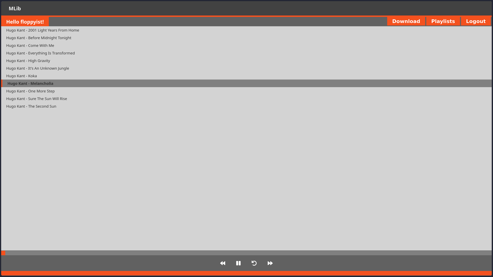

# mLib - Simple and easy-to-use music library for sharing across your network

<p align="center">
    
</p>

## Disclaimer
This project is still under development. Currently there is only one hardcoded user.

* User: floppyist
* Pass: awesomepw

## Installation

### Clone repository
```console
git clone https://github.com/floppyist/mlib
```

### Configure music folder path in mlib/cfg
```console
mv config.json.sample config.json
```

```json
{
  "general": {
    "data_path":"path/to/your/music"
  }
}
```

Make sure that your music is always in a folder that corresponds to the current mlib user. For example, if the music is in **/home/USER/music**, the folder structure must be as follows:

```bash
/home/<USER>/music/<MLIB_USER>/*.mp3
```

### Run
```bash
php -S 0:8080
```

Open browser on **http://localhost:8080/mlib.php**
